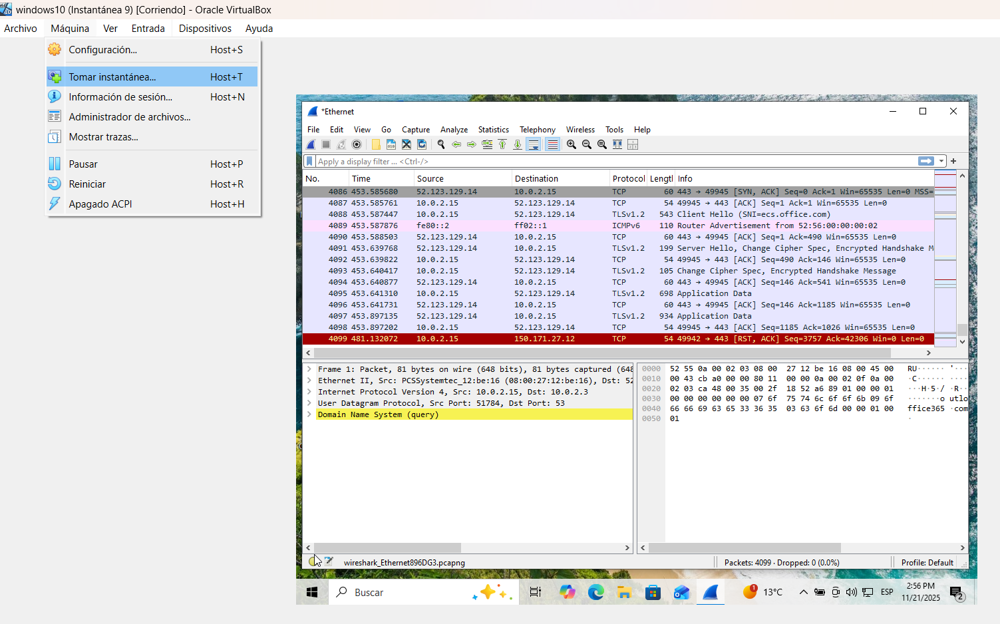

# Análisis de tráfico de red normal Vs. tráfico sospechoso (Wireshark básico)

## Objetivo:
Aprendiendo a capturar tráfico de red, aplicar filtros básicos en Wireshark, reconocer patrones normales y detectar posibles anomalías o comportamientos sospechosos.

En esta práctica analizo cómo funciona el tráfico DNS usando Wireshark, una de las herramientas más importantes en el mundo de la ciberseguridad.
DNS es básicamente “la agenda telefónica de Internet”: convierte nombres como google.com en direcciones IP.

A veces un dominio no existe o está mal escrito y cuando pasa eso, el servidor DNS responde con un código especial llamado NXDOMAIN, que significa: *“Este dominio NO existe”*

Aprender a identificar esta respuesta es clave en análisis de red, investigación de incidentes y detección de malware (porque muchos malware intentan conectarse a dominios falsos o generados al azar).

Durante este laboratorio tendremos las siguientes reacciones:
- Capturar tráfico DNS real en un entorno seguro
- Generar consultas a dominios inexistentes
- Analizar cómo aparece el código NXDOMAIN en Wireshark
- Comparar resultados en máquina virtual y red local

### Herramientas
- Wireshare (Captura y análisis)(https://wiki.wireshark.org/samplecaptures?utm_source=chatgpt.com#sample-captures)
- VirtualBox (Máquina Virtual) https://www.virtualbox.org/wiki/Downloads / Windows 10 (VM) https://www.instructables.com/GuideHow-to-Install-Windows-10-on-Oracle-VM-Virtua/
- (Para analizar IPs) https://www.virustotal.com/gui/home/url / https://nic.ar/whois / https://ipinfo.io/

### Preparación

1. Primero prepara el entorno de trabajo, abre las apps respectivas (te las indico en “Herramientas” para el análisis, por lo general son muchas pestañas que usamos por lo que, el orden que manejes es primordial para que no te confundas, ya más adelante lo harás en automático).
2. Puedes usar tu red doméstica para examinarla o como en mi caso usar una captura pública de Wireshare y examinarla en un entorno aislado como una Máquina Virtual (Oracle Virtual Box uso yo).

### Empezamos:

1. Abre Wireshare desde Virtual Box e ingresa a la interfaz de Sistema Operativo que prefieras, yo empecé con Windows. Inicia tu captura con Capture → Start (Ctrl + E) y observa como es el tráfico de red, realiza la primera captura para tu informe: Máquina → Tomar instantánea y guárdala en una carpeta preparada para eso. 

2. Usar un dominio inventado, es una forma super segura para generar tráfico que parezca sospechoso, pero sin usar malware ni dominios peligrosos.

3. Escribe en el navegador cualquier cosa que parezca un dominio, Ej. http://thisdoesnotexist123.com, o abre la consola y escribe: nslookup jhailing-noexiste-123456.com, al ejecutar, el navegador generará DNS tratando de resolver el dominio, que al no encontrarlo en wireshare verás el tráfico fallido como: NXDOMAIN, No Such Name, Name Error o Non-Existent-domain, que significa: no existe dominio (ojo, solo en respuestas DNS, no en tráfico HTTP o TCP). Para ver esto, en wireshare pon el filtro "DNS" y realiza la captura. 

Pon aqui la captura.

Un "error" que me pasó y es que no me aparecía directamente la palabra NXDOMAIN, lo que me llevo un poco de tiempo descubrir que pasaba: Wireshark a veces no muestra literalmente “NXDOMAIN”, pero en el panel inferior se ve lo siguiente: "Reply code: 3 (Name Error)" y es exactamente lo mismo.

Si tienes capture de este error publicalo

Con este ejemplo básico de cómo empezar a observar el tráfico de red, concluyo con lo siguiente: 

1. DNS es fundamental para entender cómo se comunican los sistemas en internet.

2. NXDOMAIN indica que un dominio no existe y es clave para detectar errores, malware y fallas de configuración y en caso que no aparezca esta palabra hay otros referentes que significan lo mismo.

3. Wireshark es la herramienta ideal para aprender y capturar este tipo de tráfico.

4. La VM brinda un entorno seguro y controlado para practicar sin miedo.

