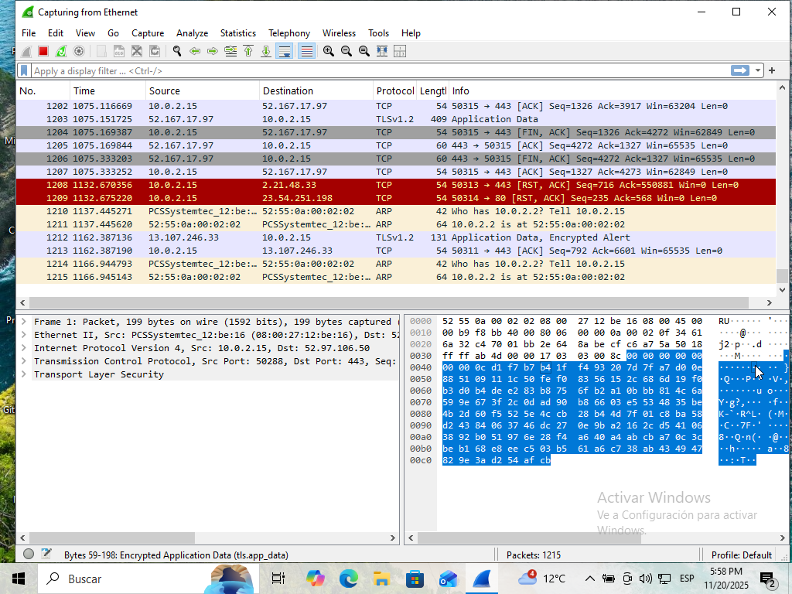
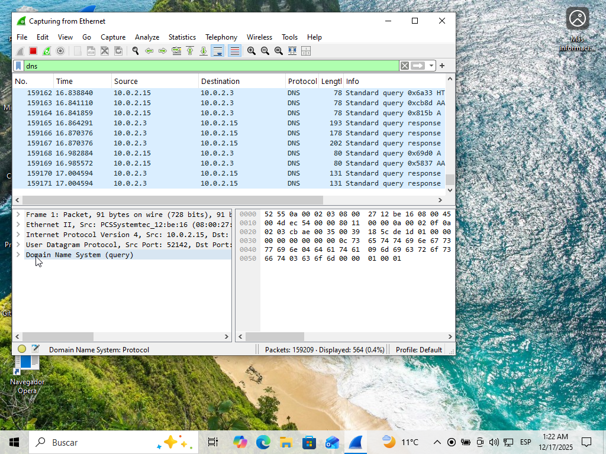
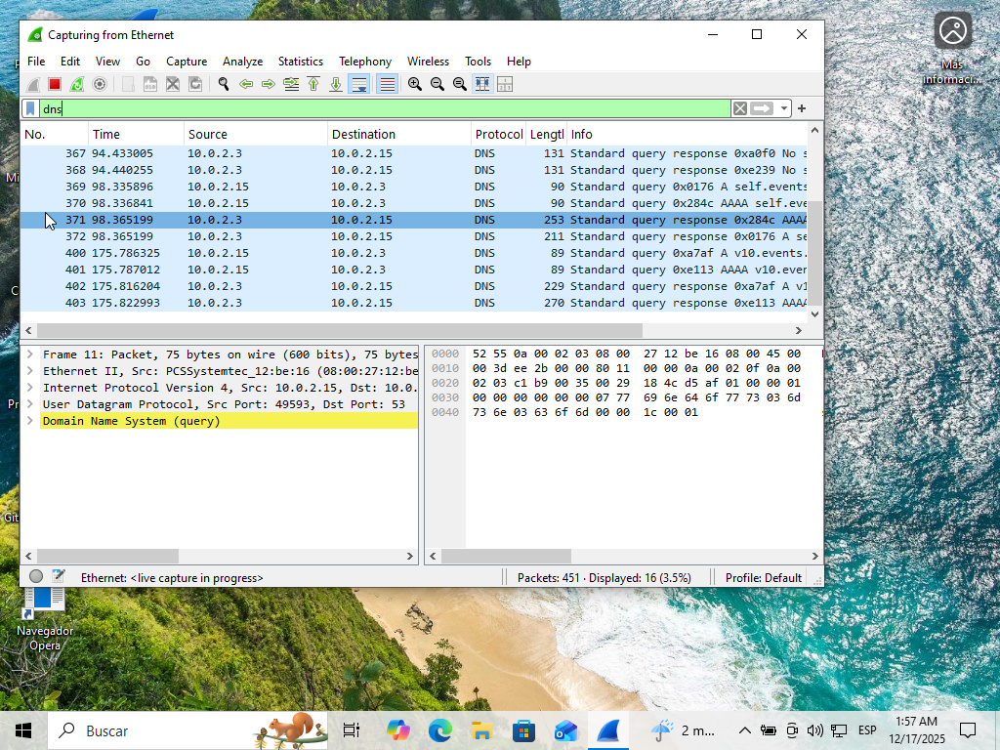
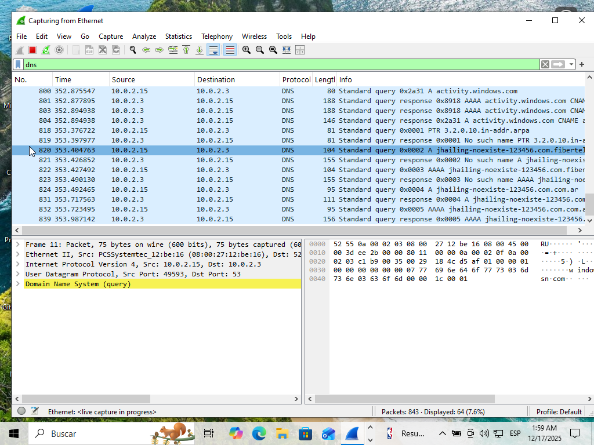
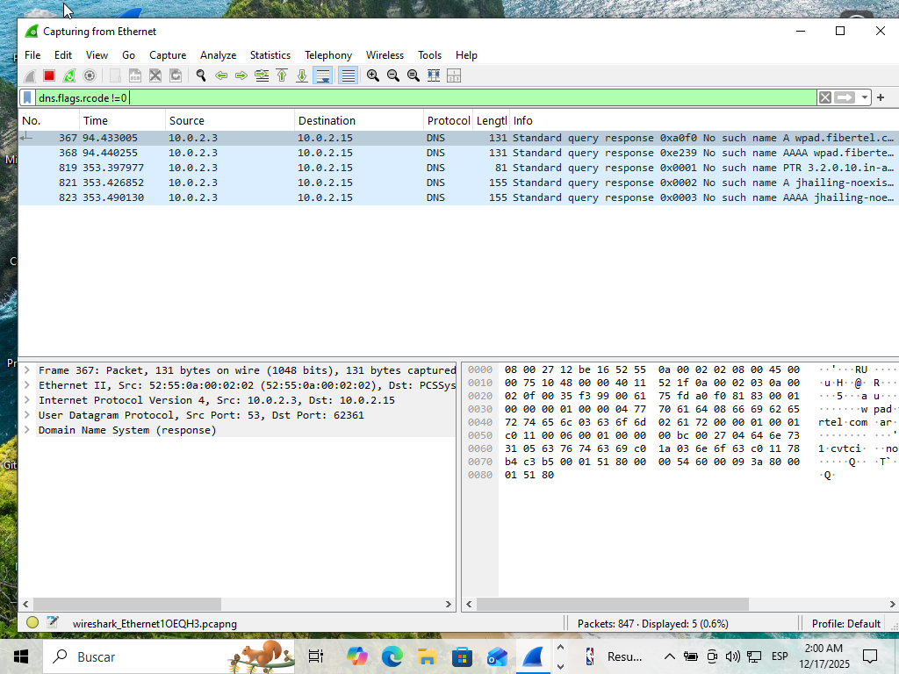
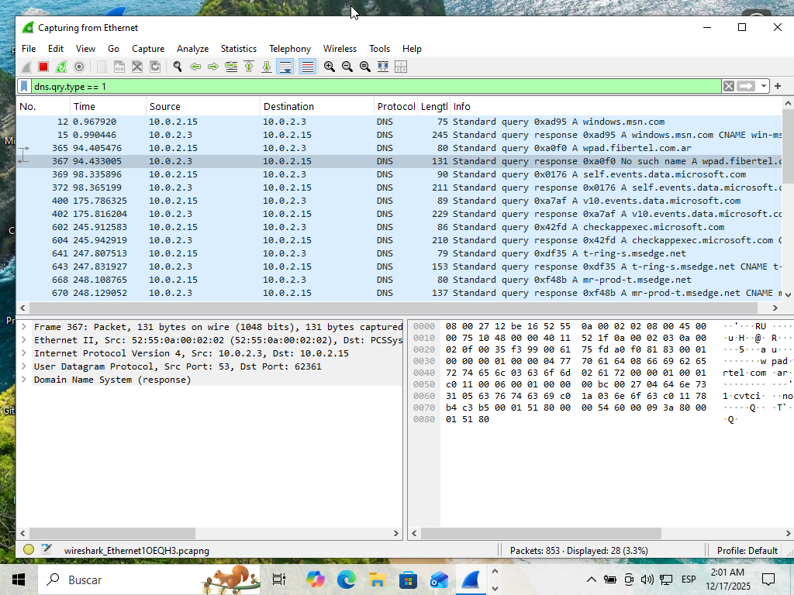
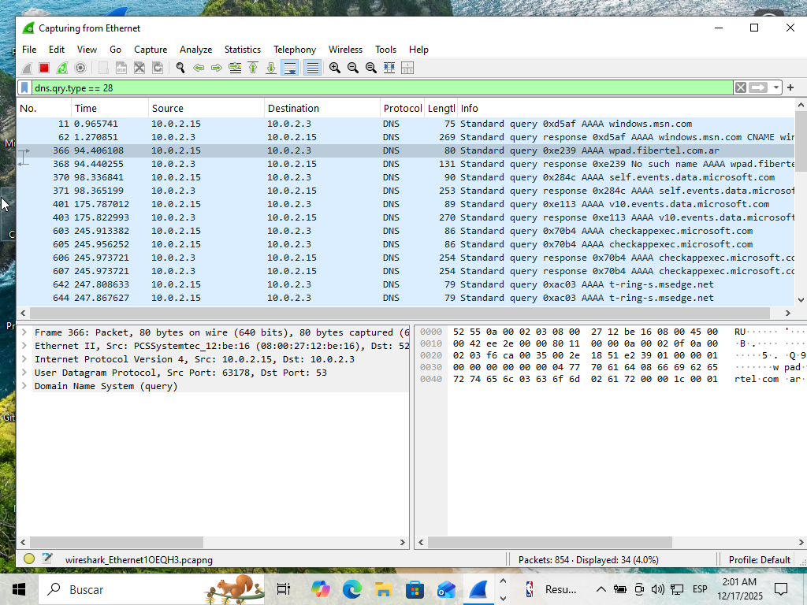
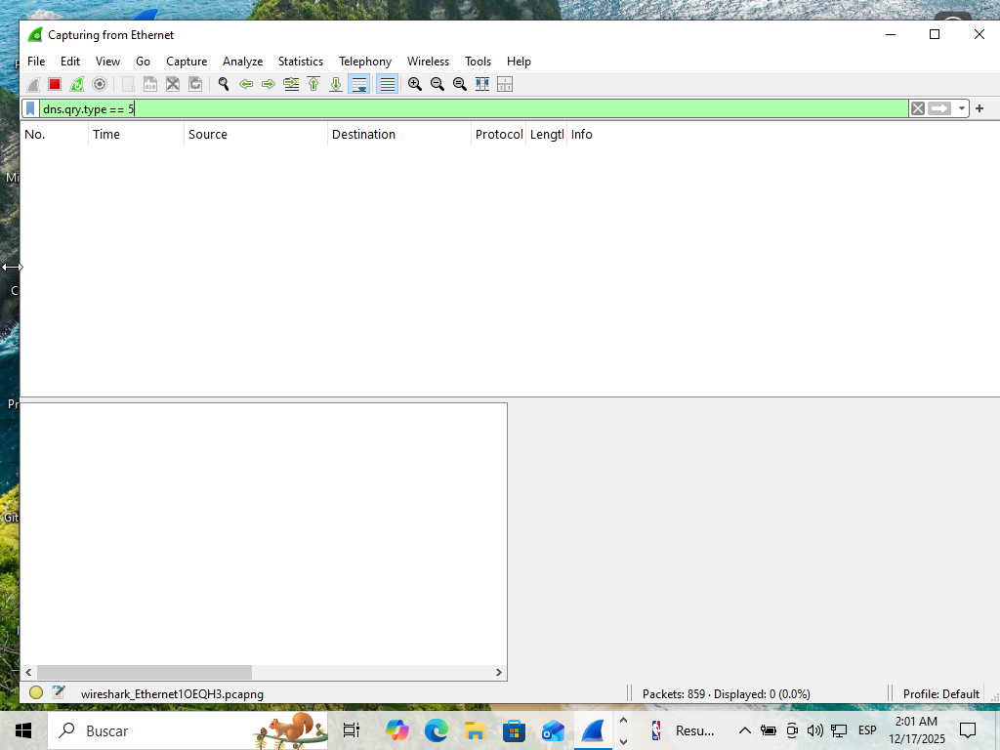
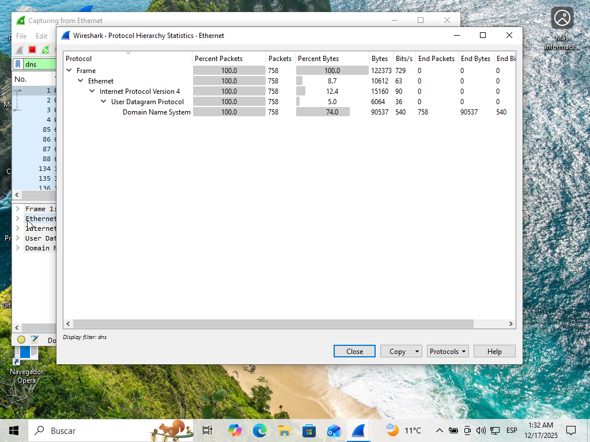

<!-- Realizado por Jhailing Ramos, Analista en Ciberseguridad -->
# Análisis de tráfico de red normal Vs. tráfico sospechoso (Wireshark básico)

## Objetivo:
En esta práctica analizo cómo funciona el tráfico DNS usando Wireshark, una de las herramientas más importantes en el mundo de la ciberseguridad.

Aprendiendo a capturar tráfico de red, aplicar filtros básicos en Wireshark, reconocer patrones normales y detectar posibles anomalías o comportamientos sospechosos.

DNS es básicamente la agenda telefónica de Internet: convierte nombres como google.com en direcciones IP.

A veces un dominio no existe o está mal escrito y cuando pasa eso, el servidor DNS responde con un código especial llamado NXDOMAIN, que significa: *“Este dominio no existe”*

Aprender a identificar esta respuesta es clave en análisis de red, investigación de incidentes y detección de malware (porque muchos malware intentan conectarse a dominios falsos o generados al azar).

Durante este laboratorio tendremos las siguientes reacciones:
- Capturar tráfico DNS real en un entorno seguro
- Generar consultas a dominios inexistentes
- Analizar cómo aparece el código NXDOMAIN en Wireshark
- Comparar resultados en máquina virtual y red local

### Herramientas
- Wireshark (Captura y análisis)(https://wiki.wireshark.org/samplecaptures?utm_source=chatgpt.com#sample-captures)
- VirtualBox (Máquina Virtual) https://www.virtualbox.org/wiki/Downloads / Windows 10 (VM) https://www.instructables.com/GuideHow-to-Install-Windows-10-on-Oracle-VM-Virtua/
- (Para analizar IPs) https://www.virustotal.com/gui/home/url / https://nic.ar/whois / https://ipinfo.io/

### Preparación

1. Primero prepara el entorno de trabajo, abre las apps respectivas (te las indico en “Herramientas” para el análisis, por lo general son muchas pestañas que usamos por lo que, el orden que manejes es primordial para que no te confundas, ya más adelante lo harás en automático).
2. Puedes usar tu red doméstica para examinarla o como en mi caso usar una captura pública de Wireshark y examinarla en un entorno aislado como una Máquina Virtual (Oracle Virtual Box uso yo).

### Empezamos:

1. Abre Wireshark desde Virtual Box e ingresa a la interfaz de Sistema Operativo que prefieras, yo empecé con Windows. Inicia tu captura con Capture → Start (Ctrl + E) y observa como es el tráfico de red, realiza la primera captura para tu informe: Máquina → Tomar instantánea y guárdala en una carpeta preparada para eso. 

2. Como modo de comparación, coloca el filtro DNS para que observes cómo es el tráfico antes de realizar la práctica.

El elevado númwero de paquetes se debe a que la máquina virtual había sido encendida hace poco, y cuando una computadora arranca pasan muchas cosas al mismo tiempo: se conectan programas, servicios, el antivirus, el sistema busca actualizaciones y el navegador prepara sus páginas. Todos estos procesos necesitan averiguar direcciones en internet, y por eso envían muchísimas consultas DNS al inicio.

Después de unos minutos, cuando todo termina de cargar y la computadora ya sabe varias direcciones porque las guarda en su memoria (caché DNS), la cantidad de consultas empieza a bajar y el tráfico se vuelve normal.

3. Para empezar con estas prácticas, vamos con un ejemplo básico que es usar un dominio inventado, una forma super segura para generar tráfico que parezca sospechoso, pero sin usar malware ni dominios peligrosos y de esta forma vemos como se comporta la red.

4. Escribe en el navegador de la VM cualquier cosa que parezca un dominio, Ej. http://thisdoesnotexist123.com, o abre la consola y escribe: nslookup jhailing-noexiste-123456.com, al ejecutar, el navegador generará DNS tratando de resolver el dominio, que al no encontrarlo, en wireshark verás el tráfico fallido como: NXDOMAIN, No Such Name, Name Error o Non-Existent-domain, que significa: no existe dominio (ojo, solo en respuestas DNS, no en tráfico HTTP o TCP). 

Para ver esto, en wireshark pon el filtro "DNS" y realiza la captura. 

Un "error" que me pasó y es que no me aparecía directamente la palabra NXDOMAIN, lo que me llevo un poco de tiempo descubrir que pasaba: Wireshark a veces no muestra literalmente “NXDOMAIN”, pero en el panel inferior se ve lo siguiente: "Reply code: 3 (Name Error)" y es exactamente lo mismo.

Luego para experimentar un poco con las búsquedas, intenta con los filtros: dns.flags.rcode != 0, se usa para detectar posibles anomalías

y dns.qry.type == 1, dns.qry.type == 28, dns.qry.type == 5 se utilizan para mapear nombres de dominio a direcciones IP o a otros nombres de dominio, examina las busquedas, familiarizate con los términos que arroja cada una y usa el capture para tu informe:  

 

Con este ejemplo básico de cómo empezar a observar el tráfico de red, observamos la cantidad de paquetes que ingresa ante indicaciones (filtros) diferentes, para observar demás características, resúmenes y datos detallados del tráfico que estas capturando.
En vez de ver miles de paquetes uno por uno, aquí puedes analizar patrones, cantidades y comportamientos.

Esto confirma que el filtrado aplicado fue correcto y que la captura representa únicamente tráfico DNS sin interferencia de otros protocolos.

De acuerdo con lo visto, concluyo con lo siguiente: 

1. DNS es fundamental para entender cómo se comunican los sistemas en internet.

2. NXDOMAIN indica que un dominio no existe y es clave para detectar errores, malware y fallas de configuración y en caso que no aparezca esta palabra hay otros referentes que significan lo mismo.

3. Wireshark es la herramienta ideal para aprender y capturar este tipo de tráfico.

4. La VM brinda un entorno seguro y controlado para practicar sin miedo.

*Visita el informe de esta práctica si quieres ver la información más detallada. Nos vemos en la siguiente práctica..*
<!-- Realizado por Jhailing Ramos, Analista en Ciberseguridad -->